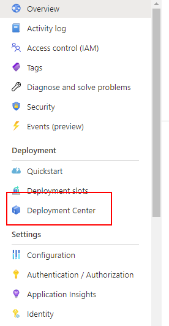

# 02 Azure FTP

In this example we are going to create a production server and upload it to Azure.

We will start from `01-production-bundle`.

# Steps to build it

- `npm install` to install previous sample packages:

```bash
npm install
```

- We are always using the `webpack-dev-server` as the website frontend server for development. But, we need a real website server for production environment, for example in nodejs. Let's implement it.

- Run build command:

```bash
npm run build
```

- Add new `package.json` in server folder:

_./server/package.json_

```json
{
  "name": "server",
  "version": "1.0.0",
  "description": "",
  "main": "index.js",
  "scripts": {
    "start": "node index.js"
  }
}

```

- Let's install [express](https://github.com/expressjs/express) as simple nodejs server:


```bash
npm install express --save
```

- We will configure in `server` folder:

_./server/index.js_

```javascript
const express = require('express');
const path = require('path');

const app = express();
const publicPath = path.resolve(__dirname, './public');
app.use('/', express.static(publicPath));

const PORT = process.env.PORT || 8081;
app.listen(PORT, () => {
  console.log(`App running on http://localhost:${PORT}`);
});

```

- Copy `./dist` files to `./server/public` folder.

- Run production server:

```bash
npm start
```

> NOTE: we can execute noder server/index.js too.

- Now, we can configure a web server, for example in `Azure` to upload files via FTP.


- Navigate to deploy center.



- And click on FTP:


- We can use whatever ftp client to connect to our server and copy all files inside `./server`:


> NOTE: Here we are using [Filezilla](https://filezilla-project.org/)
> We need to upload `dist`, `server` and `node_modules` folders.
> The `node_modules` has only the production dependencies using the command `npm install --only=production`

- As we did in local environment, we need execute same command on production:


# About Basefactor + Lemoncode

We are an innovating team of Javascript experts, passionate about turning your ideas into robust products.

[Basefactor, consultancy by Lemoncode](http://www.basefactor.com) provides consultancy and coaching services.

[Lemoncode](http://lemoncode.net/services/en/#en-home) provides training services.

For the LATAM/Spanish audience we are running an Online Front End Master degree, more info: http://lemoncode.net/master-frontend
