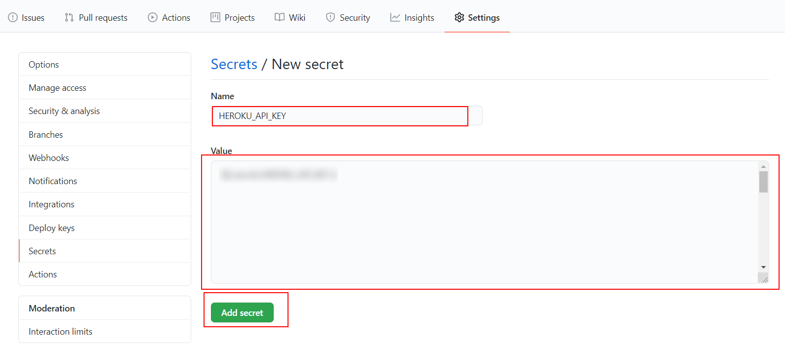

# 04 Heroku front

In this example we are going to upload Docker image with a front app to Heroku.

We will start from `03-upload-docker-image`.

# Steps to build it

- `npm install` to install previous sample packages:

```bash
npm install
```

- We will configure the [Github Actions](https://docs.github.com/en/free-pro-team@latest/actions) as we did in `02-github-actions` example.

- Create new repository and upload files:

```bash
git init
git remote add origin https://github.com/...
git add .
git commit -m "initial commit"
git push -u origin master
```

- We need an to create a [new heroku app](https://dashboard.heroku.com/) to deploy it.

- This time, we need an [auth token](https://devcenter.heroku.com/articles/heroku-cli-commands#heroku-authorizations-create) to heroku login inside Github Action job:

```bash
heroku login
heroku authorizations:create -d <description>
```

> -d: Set a custom authorization description
> -e: Set expiration in seconds (default no expiration)
> `heroku authorizations`: Get auth token list.

- Add `Auth token` to git repository secrets:




> [Heroku API KEY storage](https://devcenter.heroku.com/articles/heroku-cli-commands#heroku-authorizations-create)

- We can add `HEROKU_APP_NAME` as secret too:


- Now, we can update the `Continuos Deployment workflow`:

_./.github/workflows/cd.yml_

```diff
...
jobs:
  cd:
    runs-on: ubuntu-latest
    steps:
      - name: Checkout repository
        uses: actions/checkout@v2
-     - name: Use SSH key
-       run: |
-         mkdir -p ~/.ssh/
-         echo "${{secrets.SSH_PRIVATE_KEY}}" > ~/.ssh/id_rsa
-         sudo chmod 600 ~/.ssh/id_rsa
-     - name: Git config
-       run: |
-         git config --global user.email "cd-user@my-app.com"
-         git config --global user.name "cd-user"
-     - name: Install
-       run: npm install
-     - name: Build
-       run: npm run build
-     - name: Deploy
-       run: npm run deploy -- -r git@github.com:nasdan/test-cloud.git

```

_./.github/workflows/cd.yml_

```diff
name: Continuos Deployment workflow

on:
  push:
    branches:
      - master
+ env:
+   HEROKU_API_KEY: ${{ secrets.HEROKU_API_KEY }}
+   IMAGE_NAME: registry.heroku.com/${{ secrets.HEROKU_APP_NAME }}/web

jobs:
  cd:
    runs-on: ubuntu-latest
    steps:
      - name: Checkout repository
        uses: actions/checkout@v2
+     - name: Install heroku and login
+       run: |
+         curl https://cli-assets.heroku.com/install-ubuntu.sh | sh
+         heroku container:login
+     - name: Build docker image
+       run: docker build -t ${{ env.IMAGE_NAME }} .
+     - name: Deploy docker image
+       run: docker push ${{ env.IMAGE_NAME }}
+     - name: Release
+       run: heroku container:release web -a ${{ secrets.HEROKU_APP_NAME }}

```

> NOTE: You don't need to run `heroku login` using `HEROKU_API_KEY env variable`.
> References:
> [Heroku install](https://devcenter.heroku.com/articles/heroku-cli#standalone-installation)
> [Heroku Docker Deploy](https://devcenter.heroku.com/articles/container-registry-and-runtime)
> [Github context](https://docs.github.com/en/free-pro-team@latest/actions/reference/context-and-expression-syntax-for-github-actions#github-context)

- Git commit and push.

# About Basefactor + Lemoncode

We are an innovating team of Javascript experts, passionate about turning your ideas into robust products.

[Basefactor, consultancy by Lemoncode](http://www.basefactor.com) provides consultancy and coaching services.

[Lemoncode](http://lemoncode.net/services/en/#en-home) provides training services.

For the LATAM/Spanish audience we are running an Online Front End Master degree, more info: http://lemoncode.net/master-frontend
